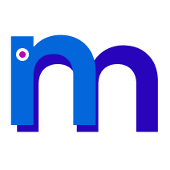

[![Contributors][contributors-shield]][contributors-url]

[![Forks][forks-shield]][forks-url]

[![Stargazers][stars-shield]][stars-url]

[![Issues][issues-shield]][issues-url]

[![MIT License][license-shield]][license-url]

<!-- PROJECT LOGO -->

<br />

<div  align="center">

<a  href="https://github.com/codeyzx/nutrimama">



</a>

<h3  align="center">Nutrimama</h3>

<p  align="center">

Nutrimama is a mobile application that helps users track their daily nutrition intake, analyze the nutritional content of food, and plan personalized diets. The app also includes features for food comparison, food redistribution, waste utilization, and health education.

<br/>
<br/>

<a  href="https://github.com/codeyzx/nutrimama">View Demo</a>
·
<a  href="https://github.com/codeyzx/nutrimama/issues">Report Bug</a>
·
<a  href="https://github.com/codeyzx/nutrimama/issues">Request Feature</a>

</p>

</div>

## Features

<!--  -->

<!-- ### 1. Nutritional Analysis

Nutrimama analyze nutrition accurately and quickly. Users can easily access real-time information about calories, nutrients, and other nutritional aspects of the food they consume.

### 2. Food Comparison

The application includes a food comparison feature, allowing users to compare the nutritional content of two or more types of food. This empowers users to make healthier food choices with a powerful tool at their disposal.

### 3. Personalized Diet Planning

Nutrimama can plan users' daily diets with personalization in mind. Considering individual preferences, allergies, and nutritional needs, the app provides food recommendations to help users achieve their health goals.

### 4. Food Redistribution and Rewards

An innovative feature involves the redirection of leftover food. Users who donate their excess food to food banks receive reward coins as a form of incentive. These coins can be exchanged for various benefits, creating a positive incentive for users to participate in food sustainability efforts.

### 5. Waste Utilization

Nutrimama encourages users to repurpose their food waste by turning it into compost, food for maggots, or food that can be consumed again.

### 6. Health Education Platform

The app is not just an information provider; it also functions as a health education platform. Informative articles, webinars, and other multimedia content help enhance users' understanding of the importance of health and the impact of food on the body. -->

## Technologies Used

- Flutter
- Firebase (Authentication, Firestore Database, Storage)

## Getting Started

1. Clone the repository:
   ```sh
   git clone https://github.com/codeyzx/nutrimama.git
   ```
2. Install dependencies:
   ```sh
   flutter pub get
   ```
3. Run the application:
   ```sh
   flutter run
   ```

## Demo App

<!-- | Image 1                            | Image 2                            |
| ---------------------------------- | ---------------------------------- |
|  |  |

| Image 3                            | Image 4                            |
| ---------------------------------- | ---------------------------------- |
|  |  |

| Image 5                            | Image 6                            |
| ---------------------------------- | ---------------------------------- |
|  |  |

| Image 7                            | Image 8                            |
| ---------------------------------- | ---------------------------------- |
|  |  |

| Image 9                            | Image 10                             |
| ---------------------------------- | ------------------------------------ |
|  |  |

| Image 11                           | Image 12                             |
| ---------------------------------- | ------------------------------------ |
| |  |

| Image 13                           | Image 14                             |
| ---------------------------------- | ------------------------------------ |
| |  |

| Image 15                           | Image 16                            |
| ---------------------------------- | ------------------------------------ |
| |  |

| Image 17                           | Image 18                             |
| ---------------------------------- | ------------------------------------ |
| |  |

| Image 19                            
| ----------------------------------  
|   -->

## License

Distributed under the MIT License. See `LICENSE.txt` for more information.

## Created by Orbit Team 
- Yahya Alfon Sinaga
- Muhammad Favian Jiwani
- Muhammad Emirsyah Makarim
<!-- MARKDOWN LINKS & IMAGES -->

<!-- https://www.markdownguide.org/basic-syntax/#reference-style-links -->

[contributors-shield]: https://img.shields.io/github/contributors/codeyzx/nutrimama.svg?style=for-the-badge
[contributors-url]: https://github.com/codeyzx/nutrimama/graphs/contributors
[forks-shield]: https://img.shields.io/github/forks/codeyzx/nutrimama.svg?style=for-the-badge
[forks-url]: https://github.com/codeyzx/nutrimama/network/members
[stars-shield]: https://img.shields.io/github/stars/codeyzx/nutrimama.svg?style=for-the-badge
[stars-url]: https://github.com/codeyzx/nutrimama/stargazers
[issues-shield]: https://img.shields.io/github/issues/codeyzx/nutrimama.svg?style=for-the-badge
[issues-url]: https://github.com/codeyzx/nutrimama/issues
[license-shield]: https://img.shields.io/github/license/othneildrew/Best-README-Template.svg?style=for-the-badge
[license-url]: https://github.com/codeyzx/nutrimama/blob/main/LICENSE.txt
